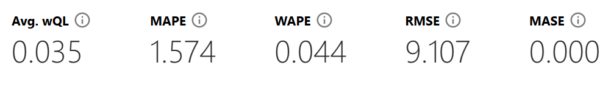

# 📊 Previsão de Geração de Energia Eólica na AWS com [SageMaker Canvas](https://aws.amazon.com/pt/sagemaker/canvas/)

Bem-vindo ao desafio de projeto "Previsão de Geração de Energia Eólica na AWS com SageMaker Canvas". O objetivo deste desafio de projeto é aprender a utilizar o SageMaker Canvas, solução para criação de modelos de machine learning disponíbilizada pela AWS, para construir um modelo preditivo para geração de energia de usinas eólicas brasileiras.

As bases de dados utilizadas para construção deste modelo foram extraídas do site da ONS (Operador Nacional do Sistema Elétrico) e são dados abertos disponíveis para livre acesso. (https://dados.ons.or.br). Foram utilizados dados mensais de geração de energia no período de janeiro de 2023 à julho de 2024 de todas as usinas eólicas ativas no país.

Um pouco mais sobre os dados e sobre a ONS:
DADOS DE RESTRIÇÃO DE OPERAÇÃO POR CONSTRAINED-OFF DE USINAS EÓLICAS - Informações associadas à apuração das restrições de operação por Constrained-off nas usinas eólicas classificadas nas modalidades Tipo I, Tipo II-B e Tipo II-C.

O Operador Nacional do Sistema Elétrico (ONS) é responsável pela coordenação e controle da operação das instalações de geração e transmissão de energia elétrica no Sistema Interligado Nacional (SIN) e pelo planejamento da operação dos sistemas isolados do país, sob a fiscalização e regulação da Agência Nacional de Energia Elétrica (Aneel). Com a certificação internacional da edição 2021 do Great Place to Work (GPTW), o órgão tem centros de monitoramento, com equipes atuando 24 horas durante todos os dias da semana, espalhados por quatro estados: Rio de Janeiro, Brasília, Recife e Florianópolis. O ONS é composto por membros associados e membros participantes, que são as empresas de geração, transmissão, distribuição, consumidores livres, importadores e exportadores de energia. Também participam o Ministério de Minas e Energia (MME) e representantes dos Conselhos de Consumidores.

## 📋 Pré-requisitos

Antes de começar, certifique-se de ter uma conta na AWS. Se precisar de ajuda para criar sua conta, confira nosso repositório [AWS Cloud Quickstart](https://github.com/digitalinnovationone/aws-cloud-quickstart).

## 🎯 Objetivos Deste Desafio de Projeto (Lab)

## 🚀 Passo a Passo

### 1. Selecionar Dataset

-   Como mencionado, os dados foram extraídos do site da ONS e estão disponíveis na pasta `dataset`.
-   Todos os 19 arquivos foram utilizados para a construção do modelo.
-   Apenas um pequeno ajuste na formatação dos arquivos foram necessários para o upload com sucesso no SageMaker Canvas, alteração de ; para , como separador de colunas.
-   Após ajuste, foi feito o upload no SageMaker Canvas.

### 2. Construir/Treinar

-   No SageMaker Canvas, foram importados os datasets selecionados.
-   Para a configuração das variáveis de entrada e saída foi selecionado a coluna `val_geracao` como target e a coluna `nom_usina` como a coluna de ID para a série temporal.
-   Algumas colunas desnecessárias para a análise foram retiradas, como própria sugestão do SageMaker (id_subsistema, nom_subsistema, id_estado, nom_estado e ceg).
-   Após configurações feitas, foi iniciado o treinamento e construção do modelo. Para isso, foi selecionado o módulo `Standard build` no SageMaker, essa forma de construção é mais vagarosa, porém, mais assertiva. O modelo levou aproximadamente 5 horas para ser treinado e finalizado.

### 3. Analisar

-   Após treinamento, as seguintes métricas foram extraídas:

-   A métrica Avg. wQL (Average Weighted Quantile Loss) é usada para avaliar a precisão de modelos de previsão probabilística, particularmente em quantiles. Quando você obtém um valor Avg. wQL de 0.035, isso indica que, em média, o modelo tem um erro ponderado de 0.035 ao prever os quantis.
Baixo Valor (Próximo de 0): Indica que o modelo está fazendo previsões de quantil com alta precisão. Um valor de 0.035 sugere que o modelo está funcionando bem, com erros relativamente pequenos nas previsões dos quantis.

-   A métrica MAPE (Mean Absolute Percentage Error) é uma medida da precisão de um modelo de previsão. Ela é calculada como a média dos erros absolutos em termos percentuais, o que permite avaliar o desempenho do modelo independentemente da escala dos dados. Um MAPE de 1.574 indica que o modelo de previsão tem um erro percentual médio de 1.574%, o que geralmente é considerado insatisfatório na maioria dos contextos. Esse valor sugere que o modelo pode precisar de melhorias, como ajuste de hiperparâmetros, seleção de características, ou mudança na abordagem de modelagem.

-   A métrica WAPE (Weighted Absolute Percentage Error) é uma variante do MAPE (Mean Absolute Percentage Error) que leva em consideração a importância relativa de cada observação, ponderando os erros absolutos pela magnitude dos valores reais. Um WAPE de 0.044 indica que o modelo de previsão tem um erro absoluto médio ponderado de 4.4%, o que sugere que o modelo está performando bem. No entanto, a aceitação desse valor depende do contexto específico e dos requisitos de precisão do problema em questão. 

-   A métrica RMSE (Root Mean Squared Error) é uma medida da precisão de um modelo de previsão, especialmente utilizada para avaliar a diferença entre os valores previstos pelo modelo e os valores reais. Um RMSE de 9.107 significa que, em média, a magnitude dos erros de previsão é 9.107 unidades. Esse valor deve ser interpretado no contexto dos dados e das unidades específicas usadas. Se os valores reais são grandes, um RMSE de 9.107 pode ser aceitável, mas se os valores reais são pequenos, esse RMSE pode indicar um desempenho ruim.

### 4. Prever

-   Use o modelo treinado para fazer previsões de estoque.
-   Exporte os resultados e analise as previsões geradas.
-   Documente suas conclusões e qualquer insight obtido a partir das previsões.

## 🤔 Dúvidas?

Esperamos que esta experiência tenha sido enriquecedora e que você tenha aprendido mais sobre Machine Learning aplicado a problemas reais. Se tiver alguma dúvida, não hesite em abrir uma issue neste repositório.
